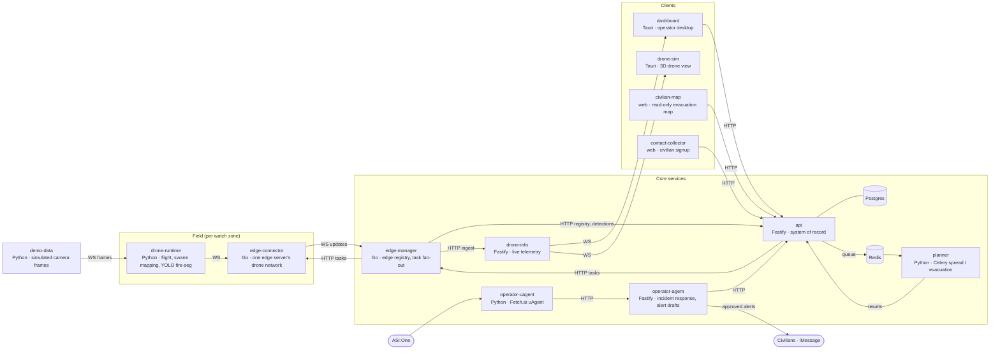

# Ember

Ember is a wildfire detection and response platform: drone swarms coordinated by edge servers map
forests and spot fire, planners predict its spread and evacuation routes, and operators act on it from
a desktop dashboard while civilians are alerted only after an operator approves.

## Architecture

Every arrow is the only channel between those two services; the full list, with routes, is in
[docs/architecture.md](docs/architecture.md).
