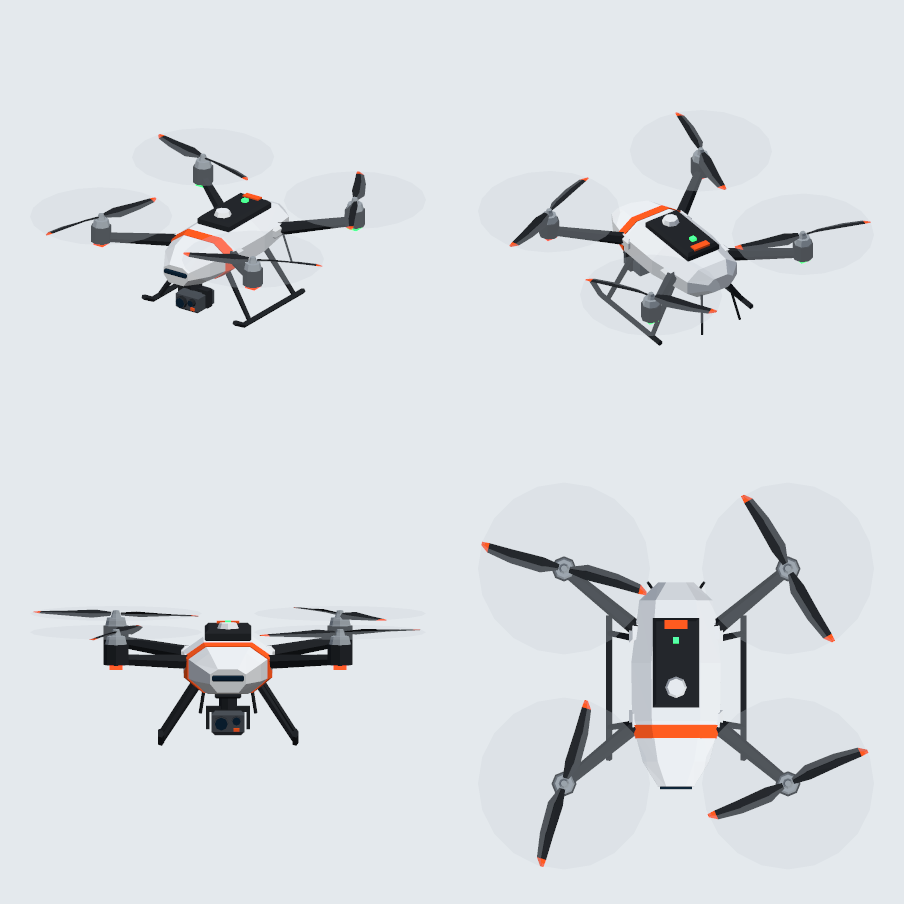
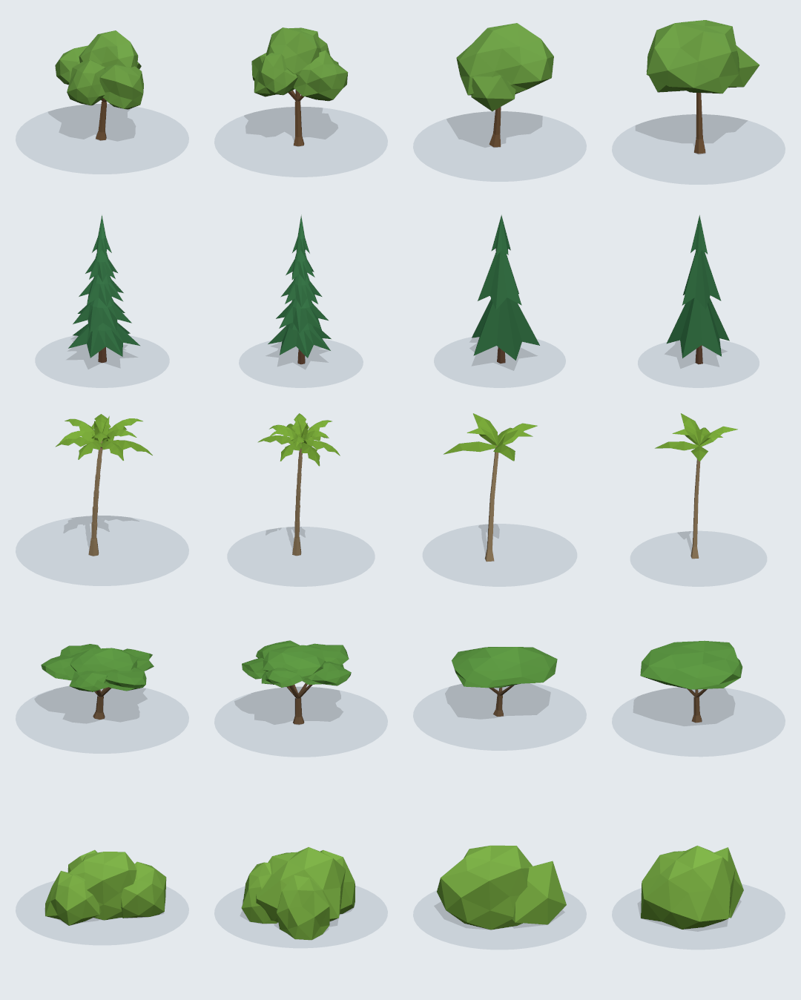
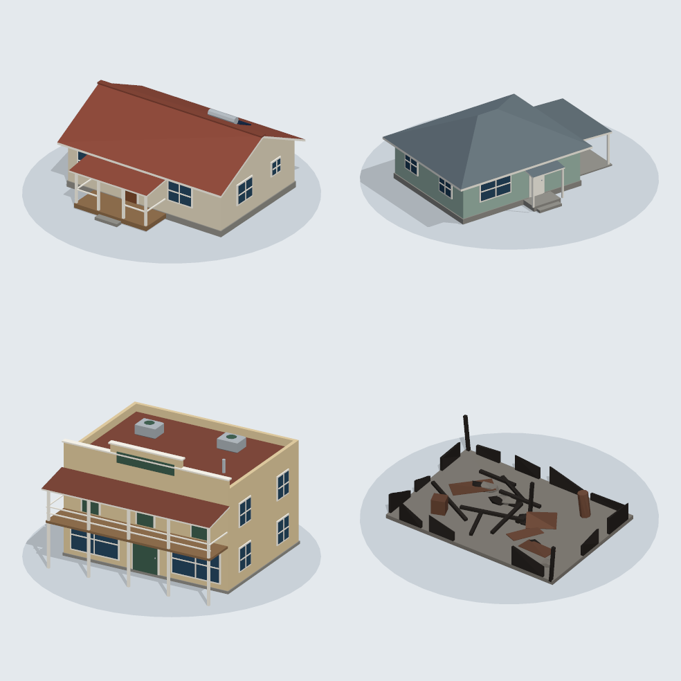
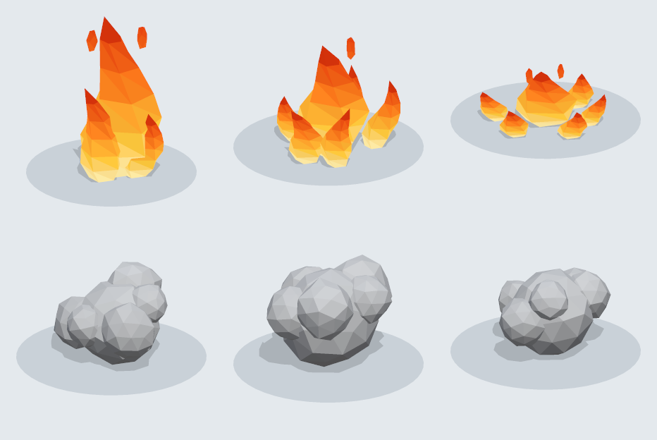

# assets

Low-poly 3D models for the sim (`apps/drone-sim`): flat-shaded facets, flat colours, no textures. The
sim draws its drone, trees, buildings, flames and smoke with them (`apps/drone-sim/src/world/models.ts`).

Everything here is generated. Do not edit the files; change the model code in
`tools/asset-builder` and rebuild:

```bash
uv run asset-builder
```

## Format

- glTF 2.0 binary (`.glb`), self-contained. Metres, +Y up, front towards +Z.
- Unindexed triangles with one normal per face, which is what gives the faceted look. Load them
  as they are; do not merge vertices or recompute smooth normals.
- No textures. Each material is one flat colour, and `COLOR_0` holds a per-face tint that
  multiplies it (light on top, dark underneath, small differences between neighbouring facets). To
  recolour a part, change the material's colour and keep the vertex colours.
- Sizes a consumer needs are in the root node's `extras` (three.js: `userData`) and repeated in
  `manifest.json`, next to each model's triangle count, bounds, materials and node names.

## Models

### Drone



`drone/quadcopter.glb`: about 0.9 m across, origin at the centre of the hull.

| Node                      | Use                                                          |
| ------------------------- | ------------------------------------------------------------ |
| `propeller_front_left`    | Spin about Y, clockwise seen from above.                     |
| `propeller_rear_right`    | Spin about Y, clockwise seen from above.                     |
| `propeller_front_right`   | Spin about Y, counter-clockwise seen from above.             |
| `propeller_rear_left`     | Spin about Y, counter-clockwise seen from above.             |
| `rotor_blur_<same names>` | Translucent disc; show it instead of spinning the blades.    |
| `gimbal`                  | Rotate about X for the camera pitch. At rest it looks at +Z. |

`led_front` (orange) and `led_rear` (green) are emissive, so heading reads at night.

### Trees



Rows: broadleaf, conifer, palm, umbrella, shrub (the sim's growth forms, in its order). Columns:
variant `a`, variant `b`, then the `_lod1` version of each.

`trees/<form>_<a|b>.glb` and `trees/<form>_<a|b>_lod1.glb`, standing on the origin.

- `heightM` and `crownRadiusM` are the model's own size; scale by the tree's surveyed height and
  crown radius over these.
- `foliage` is everything that burns away; `bark` is the trunk and branches. Tint `foliage` per
  tree, and hide it for a burnt tree to leave the charred skeleton. `foliage` is double-sided.
- `_lod1` is the same tree at a fifth to a third of the triangles (80 to 140), for trees far from
  the camera.

### Buildings



`buildings/house_gable.glb`, `house_hip.glb`, `shop.glb`, `ruin.glb`: front towards +Z, standing on
the origin. `lengthM` (along X) and `widthM` (along Z) are the footprint of the walls; porches,
eaves and the carport reach beyond it. `roof` and `wall` are the materials to recolour from
imagery. `ruin` matches the gable house's footprint and is what a destroyed building becomes.

### Fire and smoke



- `fx/flame_<a|b|c>.glb`: one metre high, standing on the origin, from a tall single fire (`a`) to
  a low spread of small flames (`c`). Unlit (`KHR_materials_unlit`): the colours are the light.
  Scale by flame height.
- `fx/smoke_<a|b|c>.glb`: one metre in radius, centred on the origin. Opaque as built; scale it up
  and fade the material as the puff ages.
