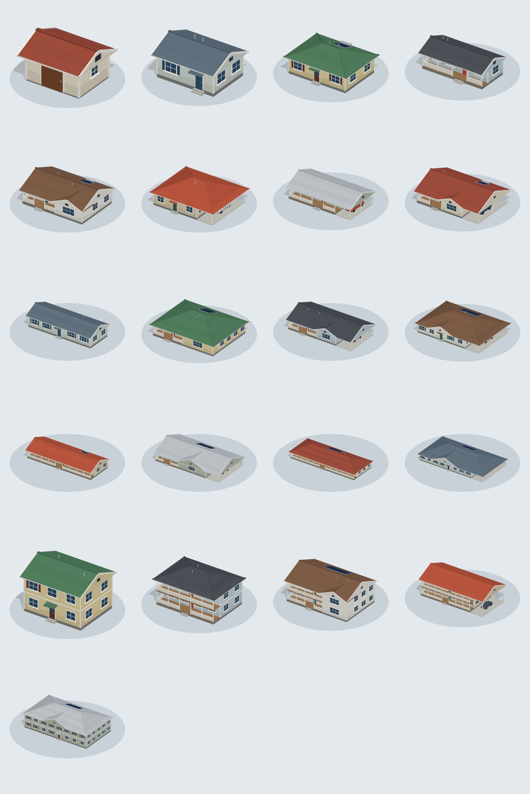
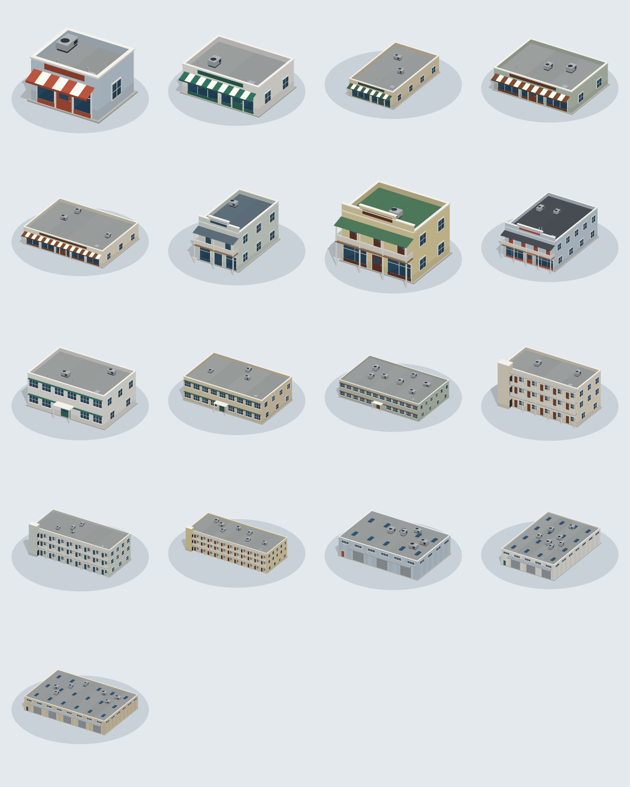
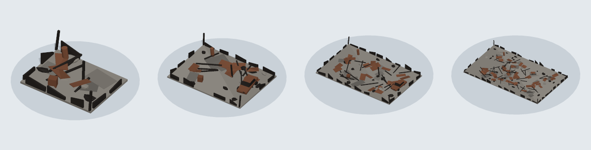

# assets

Low-poly 3D models for the sim (`apps/drone-sim`): flat-shaded facets, flat colours, no textures. Every
object the sim draws is one of them (`apps/drone-sim/src/world/models.ts` loads them): the drone, trees,
buildings and their ruins, flames, smoke and the ground.

The models are generated. Do not edit the files; change the model code in
`tools/asset-builder` and rebuild:

```bash
uv run asset-builder
```

## Format

- glTF 2.0 binary (`.glb`), self-contained. Metres, +Y up, front towards +Z.
- Unindexed triangles with one normal per face, which is what gives the faceted look. Load them
  as they are; do not merge vertices or recompute smooth normals.
- No textures. Each material is one flat colour, and `COLOR_0` holds a per-face tint that
  multiplies it (light on top, dark underneath, small differences between neighbouring facets). To
  recolour a part, change the material's colour and keep the vertex colours.
- What a consumer needs to know of a model is in its root node's `extras` (three.js: `userData`)
  and repeated in `manifest.json`, next to its triangle count, bounds, materials and node names.
- `_lod1` (and for trees `_lod2`) are the same model with fewer triangles, for far from the camera.

## Models

### Drone


`drone/quadcopter.glb`: about 0.9 m across, origin at the centre of the hull.

| Node                      | Use                                                          |
| ------------------------- | ------------------------------------------------------------ |
| `propeller_front_left`    | Spin about Y, clockwise seen from above.                     |
| `propeller_rear_right`    | Spin about Y, clockwise seen from above.                     |
| `propeller_front_right`   | Spin about Y, counter-clockwise seen from above.             |
| `propeller_rear_left`     | Spin about Y, counter-clockwise seen from above.             |
| `rotor_blur_<same names>` | Translucent disc; show it instead of spinning the blades.    |
| `gimbal`                  | Rotate about X for the camera pitch. At rest it looks at +Z. |

`led_front` (orange), `led_rear` (green) and `strobe` (white) are emissive, so heading reads at
night.

### Trees


Rows: broadleaf, conifer, palm, umbrella, shrub (the sim's growth forms, in its order). Columns:
variant `a`, variant `b`, then `a` at `_lod1` and `_lod2`.

`trees/<form>_<a|b>.glb`, `..._lod1.glb` and `..._lod2.glb`, standing on the origin.

- `heightM` and `crownRadiusM` are the model's own size; scale by the tree's surveyed height and
  crown radius over these.
- `foliage` is everything that burns away; `bark` is the trunk and branches. Tint `foliage` per
  tree, and hide it for a burnt tree to leave the charred skeleton. `foliage` is double-sided.
- Full models are 250 to 900 triangles, `_lod1` 70 to 190, `_lod2` under 40.

### Buildings

A kit made to footprints. Every model stands on the origin with its front towards +Z;
`lengthM` (along X) and `widthM` (along Z) are the footprint of its walls, and only eaves, steps,
awnings and balconies reach past it. To fit one to a surveyed rectangle, pick the model nearest in
size and scale X and Z; `wallHeightM` (eave or roof deck) is what to match a surveyed height
against. `roof` and `wall` are the materials to recolour per building. Each has a `_lod1`.



`buildings/house_<length>x<width>[_2f].glb` (`kind: "house"`): gable and hip roofs with the ridge
along X, 5 x 4 m sheds to 34 x 18 m, one and two storeys. Lanais are recessed under the main roof
and carports are the open end of it, so a house keeps to its footprint.



`buildings/<style>_<length>x<width>[_<storeys>f].glb` (`kind: "block"`), flat roofs behind a
parapet; `lengthM` is the frontage. Units of equal depth can stand side by side as a street row.

| Style    | What it is                                                    |
| -------- | ------------------------------------------------------------- |
| `store`  | One storey, glazed front under a striped awning               |
| `shop`   | Front Street timber shop: false front, balcony over the walk  |
| `office` | Two storeys of ribbon windows, entrance canopy                |
| `lodge`  | Three storeys with a walkway on every floor and a stair tower |
| `hall`   | One tall floor, sheet cladding, roller doors, roof lights     |



`buildings/ruin_<length>x<width>.glb` (`kind: "ruin"`): what a destroyed building becomes. Scale
the one nearest in size to the footprint.

### Fire and smoke


- `fx/flame_<a|b|c>.glb`: one metre high, standing on the origin, from a tall single fire (`a`) to
  a low spread of small flames (`c`): a pale core with darker tongues around it. Unlit
  (`KHR_materials_unlit`): the colours are the light. Scale by flame height.
- `fx/smoke_<a|b|c>.glb`: one metre in radius, centred on the origin. Opaque as built; scale it up
  and fade the material as the puff ages.
- Both stay under 250 triangles, since thousands are drawn at once.

### Ground

`terrain/ground.glb`: a flat square one metre across, centred on the origin. Scale it over the
world; the consumer paints it (the sim: land cover, roads and fire, as facets).

## Brand

`brand/icon.svg` is the Ember mark, drawn by hand and the only copy in the repo. The apps point at
it instead of keeping their own: the dashboard and drone-sim reference it from `index.html`, and
contact-collector copies it into its static folder at build time. The dashboard's animated logo
reads its facets from the same file (`apps/dashboard/src/icons/glyphs.ts`).

`brand/app-icon.png` is the desktop app icon: the mark, white on a black rounded square. Both Tauri
apps bundle the same set generated from it; after changing it, regenerate and copy:

```bash
pnpm --filter @ember/drone-sim exec tauri icon ../../assets/brand/app-icon.png
cp apps/drone-sim/src-tauri/icons/* apps/dashboard/src-tauri/icons/
```
